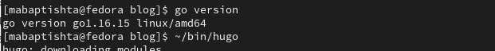
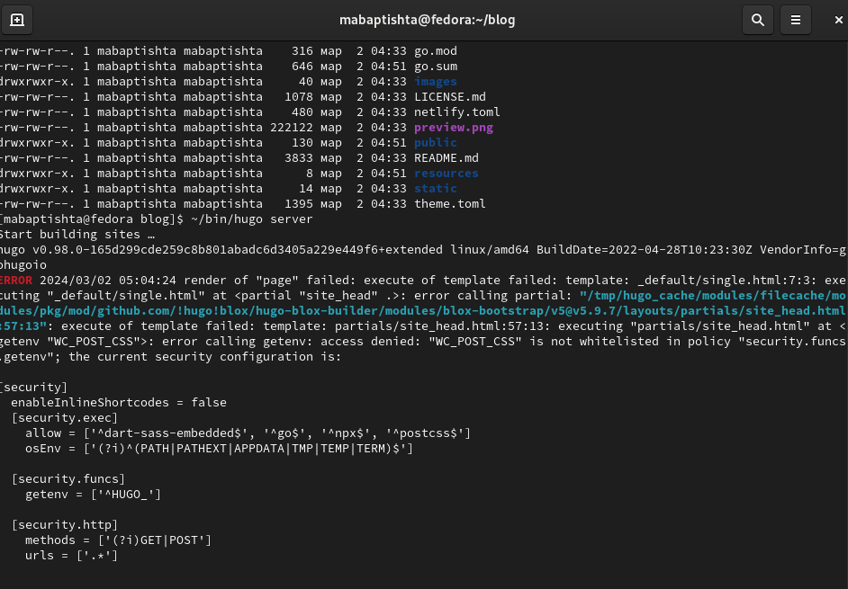
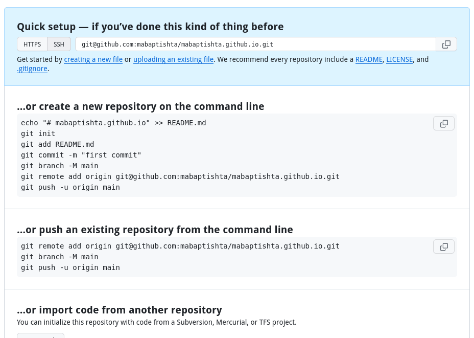
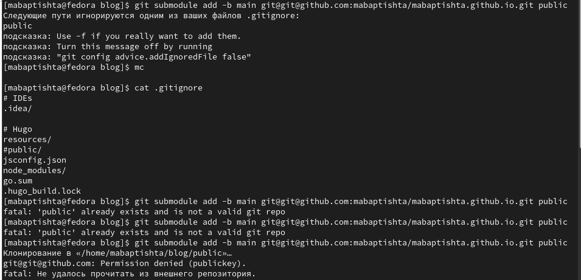

---
## Front matter
title: "Индивидуальный проект. Этап1"
subtitle: "Создание сайта на Hugo"
author: "Баптишта Матеуж"

## Generic otions
lang: ru-RU
toc-title: "Содержание"

## Bibliography
bibliography: bib/cite.bib
csl: pandoc/csl/gost-r-7-0-5-2008-numeric.csl

## Pdf output format
toc: true # Table of contents
toc-depth: 2
lof: true # List of figures
lot: true # List of tables
fontsize: 12pt
linestretch: 1.5
papersize: a4
documentclass: scrreprt
## I18n polyglossia
polyglossia-lang:
  name: russian
  options:
	- spelling=modern
	- babelshorthands=true
polyglossia-otherlangs:
  name: english
## I18n babel
babel-lang: russian
babel-otherlangs: english
## Fonts
mainfont: PT Serif
romanfont: PT Serif
sansfont: PT Sans
monofont: PT Mono
mainfontoptions: Ligatures=TeX
romanfontoptions: Ligatures=TeX
sansfontoptions: Ligatures=TeX,Scale=MatchLowercase
monofontoptions: Scale=MatchLowercase,Scale=0.9
## Biblatex
biblatex: true
biblio-style: "gost-numeric"
biblatexoptions:
  - parentracker=true
  - backend=biber
  - hyperref=auto
  - language=auto
  - autolang=other*
  - citestyle=gost-numeric
## Pandoc-crossref LaTeX customization
figureTitle: "Рис."
tableTitle: "Таблица"
listingTitle: "Листинг"
lofTitle: "Список иллюстраций"
lolTitle: "Листинги"
## Misc options
indent: true
header-includes:
  - \usepackage{indentfirst}
  - \usepackage{float} # keep figures where there are in the text
  - \floatplacement{figure}{H} # keep figures where there are in the text
---

# Цель работы
 Создать сайт на Hugo

# Задание

1. Установить необходимое програминое обеспечение.
2. Скачать шоблом темы сайта.
3. Разместить его на хостинге git.
4. Установить параметр для URLs сайта
5. Разместить заготовку сайта на Github pages

# Теоретическое введение

Сайт- это совокупность веб-страниц, обьединеных под общим доменом и связанных,тематикой и дизайнерским сформлением [@Site:bash] .мы будем создавать статическии сайтб для этого нам понадобится Hugo. Hugo - гемератор статических страниц для интернета.

# Выполнение лабораторной работы

1. Установить необходимое програминое обеспечение. Скачать Hugo и Go.  (рис. [-@fig:001])

{#fig:001 width=70%}

Проверим везсию Hugo. (рис. [-@fig:002])

{#fig:002 width=70%}

2. В качестве шаблона индивидуального сайта используетсся шаблон Hugo academic theme.  Переходим по ссылке и создаем репозиторий blog. (рис. [-@fig:003])

{#fig:003 width=70%}

Клонируем репезиторий (рис. [-@fig:004])

{#fig:004 width=70%}

3. Выполним команду hugo server (создадутся необходимые файлы). Нам предоставят ссьлкую Переходя по ней, открывается наш сайт ( пока на него можно заходиты толко с моего компютера. (рис. [-@fig:005])

{#fig:005 width=70%}

4. Необходимо создать еще один репозиторййб чтобы наш сайт можно было открывать с любого компютера. (рис. [-@fig:006])

{#fig:006 width=70%}

Клонируем наш новый репозиторий. Создаем ветку main. Создание файла README.md. Добавляем в наш репозиторййю (рис. [-@fig:007])

{#fig:007 width=70%}

5. Подключаем наш репозиторий к папке public. (рис. [-@fig:008])

{#fig:008 width=70%}

Добавление файлов в репозиторий.  (рис. [-@fig:009])

{#fig:009 width=70%}

6. Сайт готов. (рис. [-@fig:010])

{#fig:010 width=70%}

# Выводы

Научились создавать статические сайты с помощь Hugo.

